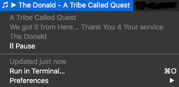

# BitBar iTunes Lite

Lightweight iTunes plugin for [BitBar](https://gitbitbar.com)



# Installation & Setup

* Install BitBar per [instructions](https://getbitbar.com)
* Clone or download [this repository](https://github.com/prenagha/bitbar-itunes) to your Mac
* Copy bbitunes.sh from the download to your BitBar Plugins Directory
* Edit ```bbitunes.sh``` and set the ```BBITUNES_DIR``` at the top to the directory of the repository download
* Rename bbitunes.sh in your Plugins directory to include the refresh interval, something like ```bbitunes.10s.sh```
